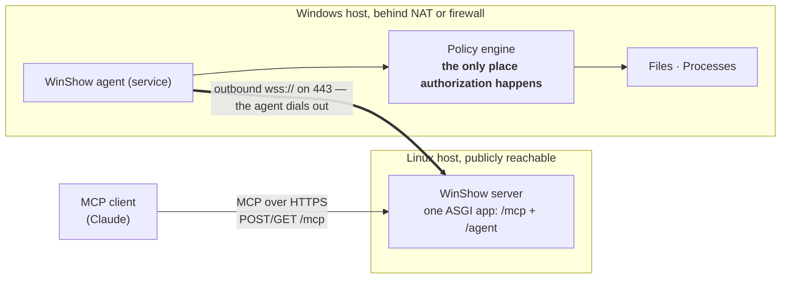

# WinShow

**An MCP server for a Windows host that cannot accept inbound connections.**

WinShow lets an AI assistant inspect files on and run commands on a remote Windows machine —
a build server in an office, a VM at a customer site, anything behind NAT or a corporate
firewall. The Windows host needs no inbound firewall rule, no port forward, and no VPN,
because **it dials out** rather than being dialled.

> **Status: design phase.** This repository contains no implementation. It contains the
> requirements, the architecture, a normative wire protocol precise enough to implement an
> agent from in any language, the policy specification, JSON Schemas, and annotated wire
> transcripts that double as conformance test vectors. See
> [`docs/09-roadmap.md`](docs/09-roadmap.md) for what comes next.

---

## How it works



A small agent on the Windows host opens an outbound TLS connection to the server and holds it
open. An MCP client calls a tool; the server forwards the operation across that existing
connection; the agent checks it against a policy the operator wrote, executes it, and answers.

**Authorization lives on the Windows host, not on the server.** The server does no filtering
of paths or commands, and the agent accepts no authorization input from the server — there is
no protocol field that can relax a rule. The machine that bears the risk holds the control, so
a compromised server can ask for anything and still get nothing the operator did not write
down.

---

## What an assistant can do with it

Read a directory listing, stat a file, read a byte range or the last *n* lines of a 17 GiB log
without transferring it, find files by glob, search file contents, and run commands from an
allowlist with streamed output, a timeout, and cancellation. Every execution is audited on
both sides.

What it deliberately cannot do: write files, open an interactive terminal, touch the registry,
impersonate another user, or see a desktop. See
[`docs/01-requirements.md` §6](docs/01-requirements.md#6-out-of-scope).

---

## Documents

| Document | For |
|---|---|
| [Overview](docs/00-overview.md) | One page of orientation — **start here** |
| [Requirements](docs/01-requirements.md) | Use cases, numbered requirements, scope, open questions |
| [Architecture](docs/02-architecture.md) | Components, deployment, lifecycle, concurrency, failure behaviour |
| [**Agent protocol (WSAP/1)**](docs/03-agent-protocol.md) | **The normative contract.** Implement an agent from this. |
| [Agent policy](docs/04-agent-policy.md) | The policy file: rules, the two-stage engine, denials |
| [MCP tool surface](docs/05-mcp-tool-surface.md) | What the assistant sees |
| [Security](docs/06-security.md) | Threat model, trust boundaries, what this does *not* protect against |
| [Operations](docs/07-operations.md) | Deploying, installing the agent, troubleshooting |
| [Conformance](docs/08-conformance.md) | A tickable checklist for agent implementers |
| [Roadmap](docs/09-roadmap.md) | Phases and their exit criteria |
| [Decision records](docs/adr/) | Why each significant choice was made |

Machine-readable artefacts live in [`docs/schemas/`](docs/schemas/), and worked examples —
three policy files and four annotated wire transcripts — in
[`docs/examples/`](docs/examples/).

---

## Two things worth knowing before you read further

**WSAP/1 is not MCP.** The Model Context Protocol governs the link between an MCP client and
the WinShow server. WSAP/1 governs the link between the server and the Windows agent. They are
separate protocols with separate versions, and an agent implementer needs to know nothing
about MCP. MCP has no dial-out transport, so a custom one was needed regardless; and the
agent's operations are deliberately lower level than MCP tools. See
[ADR 0001](docs/adr/0001-reverse-websocket-transport.md).

**A model is never what grants access.** The policy engine has an optional second stage backed
by a small model running locally on the Windows host, but it runs only on requests the
deterministic rules have already allowed, and it can only ever *deny*. The worst a confused or
prompt-injected reviewer can do is refuse work. See
[`docs/04-agent-policy.md` §6](docs/04-agent-policy.md#6-stage-2-model-assisted-review).

---

## Verifying the documents

There is no code to run yet, so what gets checked is the contract itself: every schema is
valid, every message in every transcript validates against it, event sequence numbers are
gapless, every example policy validates, every operation and error code named in the prose
exists in the schemas, and every internal link resolves.

```sh
pip install jsonschema
python3 tools/validate-docs.py
```

---

## Licence

[GNU Affero General Public License v3.0 or later](LICENSE) (`AGPL-3.0-or-later`).

The Affero clause is the operative one for software of this shape: WinShow is normally reached
over a network rather than distributed as a binary, and §13 extends the obligation to offer
corresponding source to users who interact with it remotely. If you run a modified WinShow
server that others can reach, you owe those users the source of your modifications.

Third-party dependencies keep their own licences, which are permissive and impose their own
attribution obligations. They are listed with those obligations in
[`THIRD-PARTY-NOTICES.md`](THIRD-PARTY-NOTICES.md).
