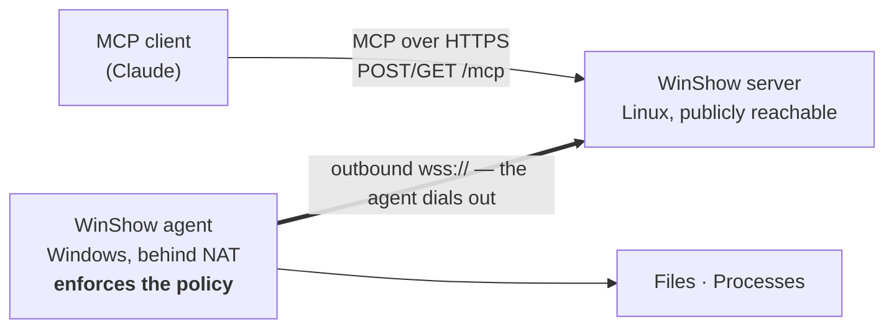

# Overview

**Status:** Draft · **Revision:** 2026-07-26

One page of orientation. Read this first, then go to whichever document answers your actual
question.

---

## What WinShow is

An **MCP server** that lets an AI assistant inspect files on and run commands on **one remote
Windows host** — a host that has no inbound reachability, because it sits behind NAT or a
corporate firewall.

The Windows host solves that by **dialling out**. A small agent running there as a Windows
service opens an outbound TLS connection to the WinShow server and keeps it open. Once the
connection is up, the server brokers requests across it: an MCP client calls a tool, the
server forwards the operation over the existing connection, the agent executes it and answers.

Two properties define the design.

**The connection direction.** The Windows host needs no inbound firewall rule, no port
forward, and no VPN. It reaches out on port 443 — the one port that reliably survives
corporate egress filtering — and it can stop participating by stopping one service. Its attack
surface from the internet stays exactly zero.

**Where authorization lives.** The server performs **no** filtering of paths or commands. The
Windows agent holds an operator-written policy file and is the sole enforcement point; it
accepts no authorization input from the server, and there is no protocol field that relaxes a
rule. The machine bearing the risk holds the control. A compromised server can ask for
anything and still gets nothing the operator did not write down.

---

## What it is not

It is not a remote access product. There is no interactive terminal, no graphical access, no
impersonation of other users, and — in the first version — no writing to the filesystem. It is
a narrow, audited, policy-gated window, and the narrowness is the point.

---

## The pieces

| Piece | What it is | Where it runs |
|---|---|---|
| **WinShow server** | Python, one ASGI application serving `/mcp` (MCP Streamable HTTP) and `/agent` (the agent WebSocket) | A small Linux VM or container |
| **WinShow agent** | Speaks WSAP/1, enforces the policy, touches the OS | The Windows host, as a service under a low-privilege account |
| **`policy.toml`** | The operator's rules: which paths are readable, which commands may run | Beside the agent, `%ProgramData%\WinShow\` |
| **WSAP/1** | The wire protocol between server and agent — deliberately **not** MCP | — |

WSAP/1 is a separate protocol on purpose. MCP has no dial-out transport, so a custom one was
needed regardless; and the agent's operations are deliberately lower level than MCP tools —
byte ranges and chunk events rather than "read a file". Composing the ergonomic surface from
the precise one is what lets each be good at its own job.

---

## Two stages of saying no

The policy engine has a deterministic stage and an optional model-assisted one:

1. **Stage 1** — allowlists, denylists, and limits written by a human. Always present, always
   authoritative.
2. **Stage 2** — an optional review by a small model running locally on the Windows host. It
   runs **only on requests stage 1 has already allowed**, and it can only ever **deny**.

That ordering is the whole safety property. A model is never the thing that grants access, so
the worst a confused or prompt-injected reviewer can do is refuse work — an availability
problem, which is recoverable — rather than permit something, which is not. Everything the
reviewer writes is treated as untrusted content and is never interpreted as instructions.

---

## Where to go next

| If you want to… | Read |
|---|---|
| Know what it must do and why the scope is cut where it is | [`01-requirements.md`](01-requirements.md) |
| Understand how it is put together and what happens when it breaks | [`02-architecture.md`](02-architecture.md) |
| **Implement an agent** in any language | [`03-agent-protocol.md`](03-agent-protocol.md), then [`08-conformance.md`](08-conformance.md) |
| Write or review a policy file | [`04-agent-policy.md`](04-agent-policy.md) and [`examples/`](examples/) |
| Know what the assistant actually sees | [`05-mcp-tool-surface.md`](05-mcp-tool-surface.md) |
| Assess the security posture | [`06-security.md`](06-security.md) |
| Deploy and run it | [`07-operations.md`](07-operations.md) |
| See a real message exchange | [`examples/transcript-happy-path.jsonl`](examples/transcript-happy-path.jsonl) |
| Understand why a decision was made | [`adr/`](adr/) |
| Know what is coming and what is deferred | [`09-roadmap.md`](09-roadmap.md) |

---

## Status

**Phase 1: design.** Nothing is implemented. This repository currently contains the
requirements, the architecture, the normative agent protocol, the policy specification,
machine-readable schemas, and annotated wire transcripts that double as conformance test
vectors.

The phase plan and its exit criteria are in [`09-roadmap.md`](09-roadmap.md). The questions
still genuinely open are listed in
[`01-requirements.md` §9](01-requirements.md#9-open-questions) rather than glossed over.
