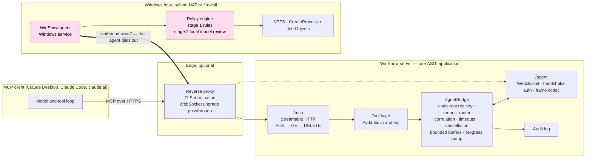
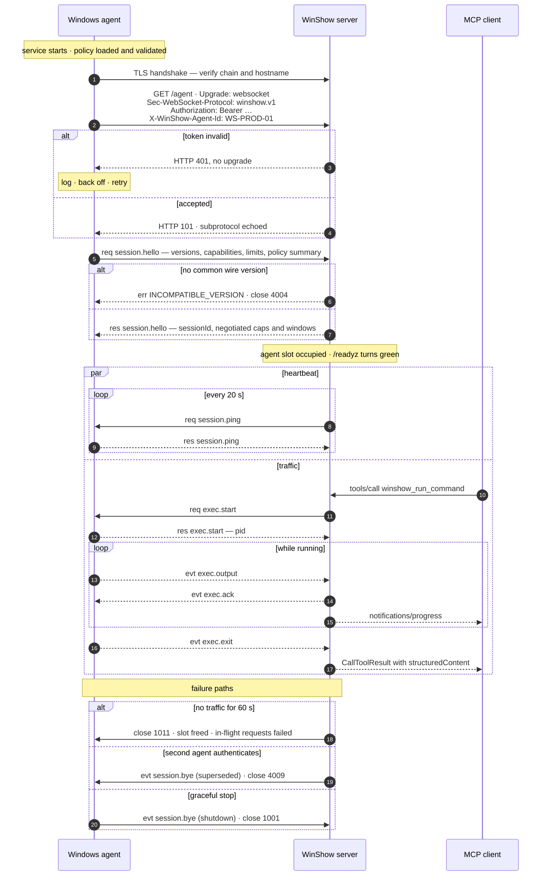

# System architecture

**Status:** Draft · **Revision:** 2026-07-26

This document describes how WinShow is put together: what the components are, where they run,
how the two protocols meet in the middle, and what happens when things go wrong. It is the
bridge between [the requirements](01-requirements.md) and
[the wire specification](03-agent-protocol.md).

---

## 1. Components



The shaded boxes mark the boundary that matters: **from the agent's point of view, everything
to its left is untrusted.** The server is an honest pipe. The agent decides.

| Component | Responsibility |
|---|---|
| **Tool layer** | Defines the MCP tools, validates their inputs and outputs against Pydantic models, and translates between MCP semantics and wire operations. |
| **AgentBridge** | Owns the single agent slot, routes requests by correlation identifier, enforces timeouts, propagates cancellation, bounds per-request buffers, and pumps output into progress notifications. |
| **WebSocket endpoint** | Authenticates the handshake, negotiates the wire version, encodes and decodes frames. |
| **Agent** | Speaks WSAP/1, enforces the policy, and touches the operating system. |
| **Policy engine** | The sole authorization mechanism. See [`04-agent-policy.md`](04-agent-policy.md). |

---

## 2. Two protocols, one process

WinShow speaks two protocols that are deliberately not the same protocol.

| | MCP | WSAP/1 |
|---|---|---|
| Between | MCP client and WinShow server | WinShow server and Windows agent |
| Transport | Streamable HTTP on `/mcp` | WebSocket over TLS on `/agent` |
| Direction of connection | Client dials the server | **Agent dials the server** |
| Specified by | modelcontextprotocol.io, revision 2025-11-25 | [`03-agent-protocol.md`](03-agent-protocol.md) |
| Vocabulary | Tools with human-facing descriptions | Byte ranges, chunk events, exit reasons |

They meet in the tool layer, and the seam between them is a feature rather than duplication.
MCP tools are the ergonomic surface a model reasons about — `winshow_read_file` with a
`tail_lines` parameter and a helpful description. Wire operations are lower level and more
precise — `fs.read` with explicit byte accounting and a reported decode-error count. Composing
one from the other is what lets each be good at its own job.

Both live in a single ASGI application, mounted side by side, sharing in-process state:

```python
# Shape only; Phase 2 implements it.
app = Starlette(
    routes=[
        Mount("/mcp", app=streamable_http_asgi_app),
        WebSocketRoute("/agent", endpoint=agent_endpoint),
        Route("/healthz", healthz), Route("/readyz", readyz),
    ],
    lifespan=combined_lifespan,   # MUST drive session_manager.run() here
)
```

The lifespan detail is not incidental. The MCP SDK's Streamable HTTP session manager must be
run from the **parent** application's lifespan; a nested lifespan on the mounted sub-application
is silently not executed, and the symptom is a server that accepts connections and then never
initialises. This is the single most common way to get the mounting wrong, and it is recorded
in [ADR 0005](adr/0005-python-mcp-sdk-selection.md).

### 2.1 A constraint from the moving specification

An MCP revision publishing 2026-07-28 removes the session model: `Mcp-Session-Id` stops being
required and client information moves into `_meta`.

The design rule that follows is simple and worth stating up front: **no WinShow state may be
keyed off `Mcp-Session-Id`.** All state lives in the `AgentBridge`, keyed by agent, not by MCP
session. Done that way, adopting the stateless model is a configuration change.

The corollary is that WinShow is **not horizontally scalable** as designed — two replicas
would each want the single agent slot, and only one can have it. For one Windows host that is
not a limitation worth engineering around, and the fix if it ever matters is a shared
agent-affinity layer in front. This is recorded as a known limitation rather than hidden.

---

## 3. Deployment

### 3.1 Where things run

The server is a single process — `uvicorn winshow.app:app` — on a small Linux virtual machine
or container that the operator controls. It holds no database. Its only durable state is the
audit log; its only volatile state is the agent slot and a bounded table of in-flight
requests.

| Path | Methods | Purpose | Authentication |
|---|---|---|---|
| `/mcp` | POST, GET, DELETE | MCP Streamable HTTP endpoint | MCP client credential |
| `/agent` | GET with `Upgrade: websocket` | The agent's reverse connection | Agent bearer token, optionally mutual TLS |
| `/healthz` | GET | Liveness — 200 whenever the process is alive | none |
| `/readyz` | GET | Readiness — 200 **only** when an agent is connected | none |
| `/metrics` | GET | Prometheus exposition | bound to a **separate** admin address, never public |

`/mcp` and `/agent` share port 443 deliberately. Port 443 is the one port that reliably
survives corporate egress filtering, and colocating them means one certificate, one DNS name,
and one firewall rule to explain to whoever administers the network.

### 3.2 Firewall direction

This is the point of the whole topology, so it is worth being explicit:

- **Windows host:** outbound TCP 443 only. No inbound rule, no port forward, no DMZ entry, no
  VPN. Its attack surface from the internet remains exactly zero.
- **Server host:** inbound 443, from the internet or from the client's network.

The Windows host *chooses* to participate and can stop participating by stopping one service.

Operational guidance, including reverse-proxy configuration and the timeouts that must be
raised for the WebSocket to survive, is in [`07-operations.md`](07-operations.md).

---

## 4. Connection lifecycle



Three details in that diagram carry more weight than their size suggests.

**Authentication is rejected before the upgrade.** A bad token costs one HTTP round trip and
never reaches the message layer or occupies the agent slot. Doing it after the upgrade, as a
challenge-response would require, hands an unauthenticated peer a socket — a free denial of
service. See [ADR 0004](adr/0004-bearer-token-over-hmac-challenge.md).

**The heartbeat is an application-level `session.ping`, not a WebSocket control ping.**
Control pings are frequently answered transparently by libraries and by middleboxes, which
proves the socket is alive but says nothing about whether the agent's event loop is. The
application-level ping proves the thing we actually care about, and carries load telemetry
while it is there.

**Each reconnection is a new session and resumes nothing.** The `resumeOf` field in the
handshake exists purely so two sessions can be stitched together in a log. No request, no
buffer, and no process survives the boundary — see
[`examples/transcript-reconnect.jsonl`](examples/transcript-reconnect.jsonl).

---

## 5. The single agent slot

`AgentBridge` holds one optional `AgentSession`. When a second connection authenticates
successfully, **the incumbent is evicted** rather than the newcomer rejected.

The reasoning is that the dominant real-world case is a half-open TCP connection after a
network partition: the server still believes an agent is attached while the agent has already
noticed and reconnected. Rejecting the newcomer leaves the system broken until the 60-second
dead-peer timer fires; evicting the incumbent self-heals in one round trip. The cost is that
someone holding the token can boot the incumbent, which is acceptable because someone holding
the token can already run whatever the policy permits. This is
[ADR 0007](adr/0007-newest-agent-wins.md).

Agent identity is verified in layers, cheapest first:

1. The shared bearer token — mandatory.
2. The `X-WinShow-Agent-Id` header and the `agentId` in the handshake must match each other,
   and must appear in the server's allowed list when that list is non-empty.
3. Optionally, a client certificate whose subject or SAN equals the `agentId`.

The hostname and operating system reported in the handshake are **advisory telemetry only**
and are never used for an authorization decision. They come from the peer.

### 5.1 Extension points for multiple hosts

Nothing is built for multi-host, but nothing precludes it either:

- `agentId` already exists end to end and is already the natural map key, so
  `Dict[str, AgentSession]` replaces `Optional[AgentSession]`.
- Every tool takes its parameters from a single Pydantic model, so adding an optional `host`
  field is additive and backwards compatible — absent means the single default host.
- The wire protocol needs **no** host field. Routing is a server concern that sits above the
  socket.
- The audit record already carries `agentId` and hostname.

What would need genuine work is a host-selection affordance the model can use, and per-host
authorization on the client side. Both are deferred.

---

## 6. Concurrency

Requests are multiplexed over the single WebSocket and correlated by identifier. The
normative rules are in
[`03-agent-protocol.md` §8](03-agent-protocol.md#8-concurrency-and-ordering); what follows is
how the server side is shaped around them.

Per-request state on the server is a small record: the identifier, the operation, the start
time, the deadline, the MCP progress token if the client supplied one, an output buffer with
its byte count, and a future to resolve. The table is bounded at the agent's advertised
`maxConcurrentRequests`; further requests queue in the server rather than being sent.

**Responses may arrive in any order**, and the server must not assume otherwise. The one
ordering guarantee is that events sharing a correlation arrive in sequence order, gapless,
with `exec.exit` last. A gap means output was lost, and the request is failed rather than
completed with a hole in it.

**Cancellation has one mechanism and three triggers** — the MCP client cancelling, the MCP
client disconnecting, and a server deadline expiring. All three send `session.cancel`. One
path means one set of bugs.

**Timeouts are two-layered.** The agent's timeout is authoritative because the agent owns the
process and can actually kill it. The server keeps a safety net set a few seconds longer; if
that ever fires, the agent is misbehaving, and the server logs it at warning level rather than
quietly papering over it.

---

## 7. Streaming, buffering and backpressure

### 7.1 What streams

Command output streams. File reads do not: `fs.read` is range-addressed, and a caller wanting
more issues another request. This asymmetry is deliberate. A model cannot usefully consume a
stream of file content, and a partial file is not a partial truth — whereas a build's output
is useful precisely as it arrives.

### 7.2 How output reaches the MCP client

Two mechanisms, both used, with a clear division of authority:

| Mechanism | Role |
|---|---|
| **Progress notifications** | Live feedback while the command runs. Requires the client to have supplied a progress token. Rate-limited to roughly four per second with intermediate chunks coalesced, per the specification's guidance on flooding. |
| **The final buffered result** | **Authoritative.** The complete captured output, up to the caps, in `structuredContent`, plus a human-readable rendering. |

The MCP specification makes progress notifications advisory: a server may send none and a
client may ignore them. Nothing may therefore depend on them, which is why the final result is
always complete rather than a summary of what was streamed. The cost is holding the output
twice in memory; the benefit is that WinShow works with every MCP client regardless of what it
implements. See [ADR 0009](adr/0009-progress-now-tasks-later.md).

### 7.3 Backpressure

The credit window is the agent's brake. It may have at most 64 unacknowledged chunks or 4 MiB
of unacknowledged bytes outstanding for one correlation, whichever it reaches first, both
negotiated at handshake. The server acknowledges as it consumes.

When the window fills, the agent stops reading the child process's pipes, so the child blocks
on its own write. That is ordinary operating-system backpressure, and it loses nothing — which
is why it is preferred over dropping chunks. If the stall persists past 30 seconds the agent
terminates the process tree and reports `exitReason: "backpressure"`, because at that point
something is wrong that waiting will not fix.

On the server side, the per-request buffer is capped. On overflow the server cancels the
request and returns what it has, flagged as truncated.

### 7.4 Truncation is head plus tail

When output exceeds the cap, the result keeps the **first quarter and the last three quarters**
of the budget, with an explicit `[… N bytes omitted …]` marker between them.

The reasoning is empirical: the interesting part of a failing build is at the end, and the
invocation banner that tells you what was actually run is at the start. Keeping only the head
gives you the command and none of the error; keeping only the tail gives you an error with no
context.

---

## 8. Behaviour when things break

### 8.1 No agent connected

The tool returns a **tool execution error** — `isError: true` with a structured payload — not
a JSON-RPC protocol error. This is deliberate: it is an actionable, transient condition that
the model should be able to reason about and explain to the user, and MCP clients feed
execution errors back to the model for exactly that purpose.

```json
{
  "ok": false,
  "error": {
    "code": "AGENT_UNAVAILABLE",
    "message": "No WinShow agent is connected. The Windows host has not dialed in.",
    "retryable": true,
    "lastSeenAt": "2026-07-26T17:02:11Z",
    "disconnectedForSeconds": 4312
  }
}
```

A small configurable grace period (`waitForAgentMs`, default 0, 3000 recommended) lets a call
arriving during a two-second reconnection blip wait rather than fail. Beyond that, fail fast:
a clear error is better than a hanging call.

### 8.2 The agent disconnects mid-call

> When the agent connection is lost, the server **MUST** complete every outstanding MCP tool
> request with an MCP error result, and **MUST NOT** leave the client waiting for its own
> timeout.

This is NFR-16 and it is stated normatively because a hang is the worst available outcome — it
gives the user neither a result nor a reason, and it looks identical to a bug in the client.

Partial results are handled asymmetrically, on purpose:

| Operation | On disconnect |
|---|---|
| `exec` | Whatever output arrived is returned, with `partial: true` and `exitReason: "disconnected"`. A truncated build log is useful. |
| `fs.read` | Partial bytes are **discarded** and an error returned. A partial file is a lie rather than a partial truth. |

### 8.3 Nothing is retried automatically

The server **must not** re-issue a request to a reconnected agent. `exec.start` is not
idempotent, and the server cannot know whether the command already ran — only that it stopped
hearing about it. Retrying is a decision for the human or the model to make, which is why
every error carries a request identifier: so somebody can go and look in the audit log first.

### 8.4 Error taxonomy and how it maps to MCP

The rule is: **anything the model or the user could act on becomes a tool execution error;
only malformed protocol usage becomes a JSON-RPC error.**

| Class | Wire codes | MCP surface | Retryable |
|---|---|---|---|
| Protocol misuse | — | JSON-RPC `-32601`, `-32602` | no |
| Transport and availability | `AGENT_UNAVAILABLE`, `AGENT_DISCONNECTED`, `AGENT_SUPERSEDED`, `AGENT_TIMEOUT` | `isError: true` | yes |
| Agent-link authentication | `UNAUTHENTICATED`, `INCOMPATIBLE_VERSION` | never reaches a tool call | — |
| **Policy denial** | `POLICY_DENIED`, `POLICY_UNAVAILABLE` | `isError: true`, with the rule named | **no** |
| Target-OS error | `NOT_FOUND`, `ACCESS_DENIED`, `SHARING_VIOLATION`, … | `isError: true`, carrying the Win32 code | sometimes |
| **Execution outcome** | *not an error* | `isError: false`, non-zero `exit_code` | — |
| Timeout | `TIMEOUT`, `exitReason: "timeout"` | execution: `isError: false` with the reason; filesystem: `isError: true` | yes |
| Limits | `AGENT_BUSY`, `RESOURCE_EXHAUSTED` | `isError: true` | yes |
| Truncation | *not an error* | `isError: false`, `truncated: true` | — |

Two rows deserve emphasis.

**A command exiting non-zero is a successful tool call.** Conflating "the build failed" with
"the tool failed" encourages a model to discard the standard output it needs in order to
explain the failure. The tool worked; the command reported an outcome.

**A policy denial is never retryable.** It will not become an allow by trying again, and
marking it retryable invites a model to churn through variants of a path until it gives up. It
should stop and tell the user what the policy would have to say.

---

## 9. Observability

### 9.1 Structured logging

JSON lines, one schema, on both sides. Server-side fields: timestamp, level, event, request
identifier, session identifier, agent identifier, MCP client identity, operation, duration,
outcome, error code, and byte counts in each direction.

The correlation property is what makes this useful: the MCP request identifier, WinShow's
internal request identifier, and the agent's session identifier appear together on every line
touching a call, so a single search reconstructs it end to end across two protocols and two
machines. The W3C `traceparent` value is propagated from `/mcp` into the wire envelope's
`trace` field — the 2026-07-28 revision formalises Trace Context, so planning for it now costs
nothing.

### 9.2 The audit trail

Every execution produces an append-only record **before dispatch** and **after completion**:

```json
{"ts":"2026-07-26T18:14:03.211Z","kind":"exec.audit","phase":"dispatch",
 "requestId":"r-7f3a91c2","agentId":"WS-PROD-01","hostname":"WS-PROD-01.corp.local",
 "mcpClient":{"name":"claude-code","version":"…"},"principal":"token:ops-key-2",
 "argv":["sc.exe","query","spooler"],"shell":"none","cwd":"C:\\Windows\\System32",
 "envOverlayKeys":["APPDATA"],"timeoutMs":30000,
 "policyDecision":"allow","policyRule":"exec.allow[svc-query]","modelReview":"approved"}
{"ts":"2026-07-26T18:14:03.688Z","kind":"exec.audit","phase":"complete",
 "requestId":"r-7f3a91c2","pid":8812,"exitCode":0,"exitReason":"exited",
 "durationMs":477,"stdoutBytes":412,"stderrBytes":0,"truncated":false}
```

Note `envOverlayKeys`: the *names* of overlaid environment variables are recorded, never their
values.

It is written **on the server**, which knows which MCP client asked, **and on the agent**,
which is the authority and whose copy survives a compromised server. The agent additionally
writes to the Windows Event Log, so the record lands in whatever the organisation already
collects Windows events into rather than in a file nobody looks at.

### 9.3 Metrics

| Metric | Type | Why it matters |
|---|---|---|
| `winshow_agent_connected` | gauge | The single most important signal — 0 means the host is unreachable |
| `winshow_agent_reconnects_total` | counter | A rising rate means an unstable link or a proxy timing the WebSocket out |
| `winshow_agent_rtt_seconds` | histogram | Derived from heartbeats |
| `winshow_requests_total{op,outcome}` | counter | |
| `winshow_request_duration_seconds{op}` | histogram | |
| `winshow_policy_denials_total{op,rule}` | counter | **The one to alert on.** A spike is either a policy that no longer matches reality, or somebody probing. |
| `winshow_inflight_requests`, `winshow_exec_running` | gauge | Saturation against the advertised limits |
| `winshow_bytes_streamed_total{direction}` | counter | |
| `winshow_truncations_total{reason}` | counter | Persistent truncation means the caps need revisiting |
