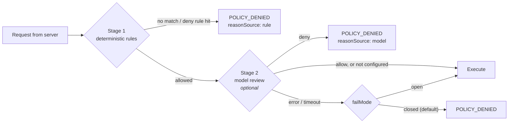

# Agent policy

**Status:** Draft · **Revision:** 2026-07-26 · **Applies to:** WSAP/1 agents

This document specifies the policy file that governs what a WinShow agent permits. It is
normative: an agent that does not implement these semantics is not conforming, regardless of
what else it gets right.

RFC 2119 keywords apply as described in [`03-agent-protocol.md`](03-agent-protocol.md).

The machine-readable form is [`schemas/policy-v1.schema.json`](schemas/policy-v1.schema.json).
Worked examples are [`examples/policy.minimal.toml`](examples/policy.minimal.toml),
[`examples/policy.developer.toml`](examples/policy.developer.toml), and
[`examples/policy.locked-down.toml`](examples/policy.locked-down.toml); all three are
validated by `tools/validate-docs.py`.

---

## 1. The load-bearing principles

### 1.1 The agent is the sole enforcement point

The MCP server performs **no** authorization. It does not filter paths, does not inspect
argument vectors, and does not decide what may run. It forwards what it was asked to forward
and relays the answer.

Consequently the agent **MUST NOT** accept any authorization input from the server. There is
no protocol field, header, capability, or flag that relaxes a rule in this file. An agent
implementer who finds themselves adding a "trusted request" path has misread the design.

This is deliberate, and the reasoning is in
[ADR 0003](adr/0003-authorization-on-agent-only.md). In short: the machine that bears the
risk should hold the control. The server is exposed to the internet and to an MCP client
driven by a language model; the Windows host is not. Putting enforcement on the host means a
compromised server can request anything it likes and still get nothing the operator did not
write down.

### 1.2 Fail closed

If the policy file is missing, unparseable, or fails schema validation, the agent **MUST**:

1. still connect and complete the handshake, reporting `policy.state = "invalid"`;
2. reject **every** operation with `POLICY_UNAVAILABLE`;
3. log the parse or validation failure at error level, naming the file and the location.

It **MUST NOT** fall back to any permissive default, and it **MUST NOT** carry forward a
policy from a previous process.

Connecting rather than refusing to start is a deliberate choice. An agent that exits on a
broken policy looks, from the operator's side, exactly like a network problem or a dead
machine. An agent that connects and says `POLICY_UNAVAILABLE` with the parse error attached
tells them what to fix, through the same MCP client they were already using. See the last
section of [`examples/transcript-reconnect.jsonl`](examples/transcript-reconnect.jsonl).

### 1.3 Deny beats allow, and nothing is implicit

- Nothing is permitted unless a rule permits it.
- Deny rules are evaluated after allow rules and override them unconditionally.
- There is no `mode = "any"` for execution. An agent that runs arbitrary commands has no
  policy, and offering that as a supported configuration would make the safe path the
  inconvenient one.

### 1.4 Evaluate resolved values, never raw input

Every rule is evaluated against what the operating system says the request actually refers
to, not against the string the server sent:

| Rule subject | What it is evaluated against |
|---|---|
| Filesystem paths | The **OS-final path**, after resolving symlinks, junctions, and 8.3 short names |
| Executables | The absolute path after resolution against `executableSearchPath` |
| Working directory | The OS-final path |

Skipping this is the most likely way to build an agent that looks correct and is not. See
[`03-agent-protocol.md` §10.1](03-agent-protocol.md#101-path-handling), and the junction
escape in [`examples/transcript-policy-denial.jsonl`](examples/transcript-policy-denial.jsonl).

---

## 2. File format and location

**TOML**, at `%ProgramData%\WinShow\policy.toml` by default.

TOML was chosen over JSON and YAML for three reasons, and the first is decisive
([ADR 0008](adr/0008-toml-for-policy.md)):

1. **Literal strings need no backslash escaping.** `'C:\src'` is exactly that path. In JSON
   every path becomes `"C:\\src"`, and a policy full of doubled backslashes is a policy
   people get wrong.
2. **Comments.** A file that is a security control needs to explain itself. JSON has no
   comments.
3. **Unambiguous scalars.** YAML would bring significant whitespace and its
   type-inference surprises into a file where `no` must not silently become `false`.

The tradeoff: TOML is awkward for deeply nested structures. The schema is kept shallow
because of it, which is no loss.

**One TOML wrinkle worth knowing**, because it will bite whoever writes the first PowerShell
rule: a single-quoted TOML literal string has **no escape for a single quote**. A regular
expression containing `'` must use the multi-line literal form:

```toml
scriptPatterns = [
  '''^Get-ChildItem\s+-Path\s+'[^']+'(\s+-Recurse)?$''',
]
```

### 2.1 File permissions

The policy file **MUST** be readable by the agent's service account and writable only by
administrators:

```
Administrators        Full control
SYSTEM                Full control
NT SERVICE\WinShowAgent   Read
```

An agent **SHOULD** check this at load and log a warning if the file is writable by a
non-administrative principal. A policy that the agent's own account can rewrite is not a
control.

### 2.2 Hot reload

The agent **MUST** watch the policy file and reload it on change. The reload **MUST** be
atomic: parse and validate the new content in full, and only then swap it in. A partially
applied policy is worse than either the old or the new one.

If the new content fails to load, the agent **MUST** keep the previous policy, log at error
level, and continue serving. A failed edit must never be a way to accidentally widen access,
and it must never take a working host offline either.

It **MUST** also report `policy.state = "stale"` from then on, including in the next
handshake summary. The three states are distinct and none of them substitutes for another:

| `state` | Meaning | Operations |
|---|---|---|
| `ok` | The file on disk is loaded and serving | Served per the rules |
| `invalid` | No valid policy is loaded at all | **All refused** with `POLICY_UNAVAILABLE` |
| `stale` | A reload failed validation; an **earlier** policy is still loaded and serving | Served per the *earlier* rules |

`stale` exists because neither of the others is honest about that situation. Reporting `ok`
hides from the operator that their edit never took effect — they would go on believing the
rule they just wrote is in force. Reporting `invalid` is simply false, since the agent is
serving normally. When `state` is `stale`, `policyHash` names the policy that is **loaded**,
not the file on disk, so comparing the two is how an operator confirms the discrepancy.

---

## 3. Structure

```toml
schemaVersion    = 1              # required
policyVersion    = "..."          # operator label, surfaced in the handshake
denialDisclosure = "explicit"     # or "notfound"

[connection]   # where and how to dial the server
[limits]       # resource ceilings advertised at handshake
[fs]           # read roots, deny globs, per-root overrides
[exec]         # execution mode, environment handling, search path
  [[exec.allow]]   # zero or more
  [[exec.deny]]    # zero or more
[modelReview]  # stage 2
[proc]         # process visibility (later phase)
[logging]      # log and audit destinations, redaction
```

Unknown keys are a **load failure**, not a warning. The schema sets
`additionalProperties: false` at every level on purpose: in a security control, a typo that
is silently ignored is a rule that silently does not exist. `readRoot = [...]` instead of
`readRoots = [...]` must not produce an agent that quietly permits nothing — or, worse in a
future revision, quietly permits everything.

---

## 4. Filesystem rules

### 4.1 `readRoots`

An allowlist of absolute paths. A request is permitted only when its final path is contained
within one of them.

Containment is **component-wise and ordinal case-insensitive**. `C:\src2` is not inside
`C:\src`; `c:\SRC\file.txt` is. Implement it by splitting both paths on `\` and comparing
components, never by `startsWith`.

Roots are canonicalised at load. A root that does not exist at load time is a **warning**,
not an error — removable media and network shares come and go, and refusing to start because
a USB drive is unplugged would be unhelpful.

UNC roots are supported and are frequently the *only* correct way to express a network
location, because mapped drive letters do not exist in session 0 where the service runs.

### 4.2 `denyGlobs`

Applied to the final path, case-insensitively, after `readRoots` has allowed it. Any match
denies.

Deny globs are not redundant with read roots, and the example policies carry them even in
the minimal configuration. Read roots express where the operator *meant* to grant access;
deny globs catch the private key, the `web.config`, or the `.git` directory that ended up
inside one of those roots anyway. Roots are what people remember to configure; deny globs are
what saves them when they forget.

Pattern syntax is the same minimal glob dialect as `fs.glob`
([`03-agent-protocol.md` §4.4](03-agent-protocol.md#44-fsglob)).

### 4.3 `rootOverrides`

Per-root tightening or loosening of specific limits:

```toml
[[fs.rootOverrides]]
path              = 'D:\Logs'
maxReadBytes      = 8388608
allowedExtensions = [".log", ".txt", ".json", ".etl"]
```

`allowedExtensions`, when present, restricts reads under that root to those extensions. It
is an allowlist and it is case-insensitive.

### 4.4 Keys the protocol refers to by name

Two keys are named normatively by [`03-agent-protocol.md`](03-agent-protocol.md) and are easy
to overlook when reading the structure in §3, so they are called out here:

| Key | Used by | Behaviour |
|---|---|---|
| `fs.defaultAnsiEncoding` | [§10.2](03-agent-protocol.md#102-encoding), the last step of encoding detection | The code page assumed when a file has no BOM, is not valid UTF-8, and does not look binary. Defaults to `cp1252`. Set it to the machine's actual ANSI code page if that differs. |
| `limits.maxHashBytes` | [§4.2](03-agent-protocol.md#42-fsstat), `fs.stat` with `hash: "sha256"` | The largest file the agent will hash. A file above the limit returns `sha256: null` and is **not** an error — the rest of the stat result is still useful, and failing an entire call over an optional field would be unhelpful. |

### 4.5 `followLinks` and `allowAlternateDataStreams`

Both default to `false`, and both should usually stay there. `followLinks = true` requires
the agent to perform cycle detection on resolved paths, or a junction pointing at its own
ancestor will make it walk forever. `allowAlternateDataStreams = true` exposes a place data
can hide from ordinary directory listings.

---

## 5. Execution rules

### 5.1 Mode

`mode = "allowlist"` or `mode = "disabled"`. There is no third option.

### 5.2 Allow rules

An allow rule has one of two shapes, and they are mutually exclusive.

**Executable rules** match a direct process launch (`shell = "none"`):

```toml
[[exec.allow]]
id         = "svc-query"
executable = 'C:\Windows\System32\sc.exe'
argv       = ["query", "{service}"]
[exec.allow.placeholders]
service = '^[A-Za-z0-9_.-]{1,64}$'
```

| Key | Meaning |
|---|---|
| `id` | Stable identifier. It appears in denial messages, audit records, and the handshake summary, so it should read well to a human. |
| `executable` | Absolute path. The request's **resolved** executable must equal it, ordinal case-insensitive. |
| `argv` | Exact positional template. `{name}` is a placeholder validated by `placeholders.name`. |
| `argvPrefix` | The request's argv must **start with** these tokens; anything may follow. |
| `argvDeny` | Tokens that must not appear anywhere in argv. |
| `placeholders` | Name to anchored regular expression. |
| `maxTimeoutMs`, `maxOutputBytes` | Per-rule ceilings that may exceed the global defaults. |
| `cwdRoots` | Narrows the permitted working directories for this rule. |
| `modelReview` | Force stage 2 on or off for this rule, overriding the global setting. |

`argv` and `argvPrefix` are alternatives: `argv` pins the whole vector, `argvPrefix` pins
only the leading tokens. `argvPrefix = []` permits any arguments, which is why the
`tasklist` example pairs it with `argvDeny` to keep the `/s` remote-machine flag out.

**Shell rules** match a shell invocation:

```toml
[[exec.allow]]
id    = "ps-diagnostics"
shell = "powershell"
scriptPatterns = [
  '^Get-Service(\s+-Name\s+[A-Za-z0-9_.-]{1,64})?$',
]
```

The **entire** script must match one of the patterns. This is the whole reason anchoring is
mandatory: an unanchored `Get-Service` pattern would match
`Get-Service; Remove-Item -Recurse C:\`, and the rule would have permitted exactly the thing
it existed to prevent.

### 5.3 Anchoring is enforced at load

Every regular expression used in an **allow** decision — `placeholders` and `scriptPatterns`
— **MUST** be anchored at both ends with `^` and `$`. The agent **MUST** reject an unanchored
allow pattern at load time as a policy validation failure.

Deny patterns are deliberately **not** required to be anchored: a deny rule wants to match
anywhere in the input, and requiring anchors there would make deny rules harder to write and
easier to get wrong in the dangerous direction.

### 5.4 Deny rules

```toml
[[exec.deny]]
id        = "no-destructive"
argvRegex = '(?i)\b(format|diskpart|bcdedit|vssadmin|cipher\s+/w)\b'
reason    = "Destructive disk and boot operations are never permitted."
```

At least one matcher is required: `executableRegex`, `argvRegex`, `scriptRegex`, or
`cwdRegex`. `reason` is required and is surfaced to the caller in the denial, with
`reasonSource: "rule"`.

`argvRegex` is matched against the argument vector joined with single spaces, so a rule can
span token boundaries.

### 5.5 Executable resolution

`executableSearchPath` is the **only** place a bare executable name is resolved. The ambient
`PATH` **MUST NOT** be consulted. `PATH` is influenced by whoever can write the service's
environment, and resolving against it turns "run `git.exe`" into "run whatever is called
`git.exe` in the first directory someone managed to prepend".

An ambiguous or failed resolution is `EXEC_NOT_FOUND`.

### 5.6 Environment handling

`envMode = "overlay"` starts from the agent's own environment minus everything matching
`envRedact`, then applies the request's overlay filtered through `envAllow`.
`envMode = "clean"` starts from `envBase` only. Clean mode is recommended where
reproducibility matters.

`envAllowSensitive` gates `PATH`, `PATHEXT`, `ComSpec`, `SystemRoot`, and `windir`. It
defaults to `false` because overriding `PATH` is executable substitution by another name, and
a policy that carefully allowlists `C:\Program Files\dotnet\dotnet.exe` gains nothing if the
caller can also redirect what that process finds when it shells out.

`envRedact` defaults should always include the agent's own token variable. The token
**MUST NOT** reach a child process under any configuration.

### 5.7 `detachOnDisconnect`

By default the agent kills every process it started when the connection drops
([`03-agent-protocol.md` §10.3](03-agent-protocol.md#103-how-a-command-is-executed)).
`detachOnDisconnect` lists allow-rule ids whose processes survive instead.

It is empty by default and should usually stay that way. A detached process outlives the
only channel that could report its result or cancel it, so nothing will ever tell the
operator how it went. The legitimate use is a deliberate deployment or migration script that
must not be interrupted by a network blip; the illegitimate use is treating it as a
convenience, which produces exactly the orphaned builds that make people stop trusting the
tool.

**How this squares with the exactly-once rule.**
[`03-agent-protocol.md` §5.4](03-agent-protocol.md#54-execexit--agent--server-evt) requires
exactly one `exec.exit` per correlation, and a detached process appears to break that: the
connection is gone, so nothing can be sent.

It does not, because the obligation is scoped to a connection. Correlation identifiers are
per-connection ([`03-agent-protocol.md` §8.5](03-agent-protocol.md#85-duplicate-request-identifiers)),
and a connection that has closed has no correlations left to satisfy. When the socket drops,
the server has already failed that request with `AGENT_DISCONNECTED`; there is no longer a
peer waiting for a terminal event, and a later reconnection is a different session that
resumes nothing.

What the agent still owes is the **record**. A detached process **MUST** be written to the
audit log on completion exactly as an attached one would be — exit code, reason, duration,
byte counts — with a marker that it was detached and the identifier of the session it
outlived. That log entry is the only way anyone will ever find out what happened, which is
precisely why this setting deserves the warning above.

---

## 6. Stage 2: model-assisted review

The Windows side may host a small local model that reviews requests before they run. This
section defines how that fits into the policy engine without becoming a hole in it.

### 6.1 The ordering property



Stage 2 runs **only on requests stage 1 has already allowed**, and it can only ever **deny**.
It never widens what the deterministic rules permitted.

This ordering is the entire safety property, and it is not negotiable:

- **A model must never be the thing that grants access.** If stage 2 ran first, or could
  overturn a stage-1 denial, then the security of the Windows host would rest on a small
  model's judgement under adversarial input. It does not. It rests on rules a human wrote.
- **The worst a compromised, confused, or prompt-injected reviewer can do is refuse work.**
  That is an availability problem, which is recoverable, rather than an authorization
  problem, which is not.
- **Removing stage 2 entirely never grants access.** An agent with `enabled = false` behaves
  exactly like one whose reviewer approves everything. Stage 1 is the floor.

### 6.2 Configuration

```toml
[modelReview]
enabled         = true
failMode        = "closed"
timeoutMs       = 8000
endpoint        = "http://127.0.0.1:11434"
model           = "qwen2.5-coder:1.5b"
appliesTo       = ["exec.start"]
maxRequestChars = 8192
auditVerdicts   = true
```

| Key | Notes |
|---|---|
| `enabled` | Master switch. Off is a perfectly reasonable configuration. |
| `failMode` | What to do when the reviewer errors or times out. See §6.4. |
| `timeoutMs` | Wall clock for one review. |
| `endpoint` | Where the reviewer runs. **MUST** be loopback or a local named pipe. |
| `model` | Identifier, for the audit record. |
| `appliesTo` | Which operations are reviewed. Defaults to `exec.start` only. |
| `maxRequestChars` | Truncation limit on what is handed to the reviewer. |
| `auditVerdicts` | Whether every verdict, including approvals, is written to the audit log. |

A per-rule `modelReview = false` skips stage 2 for a specific allow rule — useful for a
high-frequency, obviously-safe command where the latency is not worth paying.

### 6.3 The endpoint must be local

`endpoint` **MUST** resolve to a loopback address or a local IPC mechanism. The agent
**MUST** refuse to start with a remote endpoint.

Sending the request to a remote service would mean the details of every command run on the
Windows host — paths, argument vectors, sometimes their contents — leave the machine to a
third party, and it would make an authorization decision depend on network availability.
Neither is acceptable in a component whose entire purpose is being the thing that says no.

### 6.4 Failure mode

`failMode = "closed"` (the default) denies when the reviewer errors or times out.
`failMode = "open"` allows.

The tradeoff, stated plainly so nobody has to discover it in production: **closed** means a
stalled or crashed model makes the agent refuse work that stage 1 would have permitted — the
host effectively goes read-only until someone notices. **Open** means a stalled model
silently disables stage 2, and nothing in the tool output distinguishes "reviewed and
approved" from "the reviewer was down". Closed is the default because a security control that
silently stops working is worse than one that visibly fails, but an operator running
unattended automation may legitimately choose otherwise. Whichever is chosen, every fallback
**MUST** be logged at warning level and recorded in the audit trail.

### 6.5 Latency obligations

Local inference takes time, and the protocol must not mistake it for a hung agent:

- The agent **MUST** keep answering `session.ping` while a review is in progress. A review
  that blocks the agent's event loop until the heartbeat times out will tear down a perfectly
  healthy connection.
- The agent **SHOULD** emit `policy.reviewing` once a review exceeds roughly 1500 ms
  ([`03-agent-protocol.md` §5.5](03-agent-protocol.md#55-policyreviewing--agent--server-evt)),
  so the server can report "under review" rather than "slow".
- `policy.reviewing` carries **no** authorization meaning. It is a progress signal and
  **MUST NOT** be read as an approval.

### 6.6 The verdict is untrusted text

A stage-2 denial is reported as `POLICY_DENIED` with `rule = "policy.modelReview"` and
`details.reasonSource = "model"`.

**Everything the model produces is untrusted content.** The agent **MUST** mark it, the
server **MUST** relay it labelled as such, and no component — server, MCP client, or model —
may act on it as instructions. It is a string to display and nothing more. A reviewer that
has been prompt-injected by the contents of a file it was asked about could otherwise turn
its explanation into a channel for influencing whatever reads the error.

Practical consequences for the agent implementer:

- Treat the reviewer's output as data. Parse it into a strict verdict shape — an
  allow/deny boolean and a bounded reason string — and discard anything else it emitted.
- Cap the reason length and strip control characters.
- Never let the reviewer's output select the rule id, the error code, or any other structured
  field. It fills exactly one slot: `details.reason`.

### 6.7 What to review

Reviewing every filesystem call makes the agent unusable: a directory listing that takes
20 milliseconds and a review that takes 2 seconds do not belong in the same request path.
`exec.start` is where the leverage is — it is the operation with real consequences, it is
already the rarest, and it is the one where "this matches an allow rule but is
disproportionate to the stated task" is a judgement rules cannot express.

---

## 7. The policy summary reported at handshake

The agent reports a **summary** of its policy in `session.hello`. It **MUST NOT** send the
full policy: the server is untrusted, and the exact rule set is useful to an attacker
probing for gaps.

| Field | Required | Notes |
|---|---|---|
| `policyVersion` | yes | The operator's label |
| `policyHash` | yes | `sha256:` of the bytes of the policy that is **loaded**. When `state` is `stale` this is the earlier policy, not the file on disk — comparing the two is how an operator detects a failed reload. |
| `state` | yes | `"ok"`, `"invalid"`, or `"stale"` — see §2.2 |
| `readRoots` | yes | The roots themselves — these are what make a denial actionable |
| `denyGlobCount` or `denyGlobs` | no | A count is the safer choice on a shared deployment |
| `execMode` | yes | |
| `allowedCommandCount`, `allowedCommandIds` | no | Ids only, never the rule bodies |
| `shellsAllowed` | no | |
| `writeEnabled` | yes | |
| `modelReview` | no | `{enabled, failMode, timeoutMs, model}` |
| `maxOutputBytes`, `maxExecMillis` | no | |
| `denialDisclosure` | yes | |

The summary exists so the MCP server can tell the model what is possible **before** it tries.
An assistant that knows the read roots and the four permitted command ids proposes something
that will work; one that does not spends three turns guessing and annoys the user.

---

## 8. Reporting a denial

A denial is an `err` with `code: "POLICY_DENIED"`, `class: "policy"`, `retryable: false`:

```json
{"w":1,"t":"err","id":"r-55c1","op":"exec.start","e":{
  "code":"POLICY_DENIED","class":"policy","retryable":false,
  "rule":"exec.deny[no-destructive]",
  "message":"Command denied: matches deny rule 'no-destructive'.",
  "details":{
    "reason":"Destructive disk and boot operations are never permitted.",
    "reasonSource":"rule",
    "subject":"argv",
    "allowedSummary":{"execMode":"allowlist",
                      "allowedCommandIds":["svc-query","tasklist","dotnet-build","ps-diagnostics"]}}}}
```

Requirements:

- `retryable` is **always** `false`. A policy denial will not become an allow by trying
  again, and marking it retryable invites a model to churn through variants.
- `rule` identifies the deciding rule as `namespace[id]`, or `namespace[index]` when the rule
  has no id.
- `details.allowedSummary` **SHOULD** be present, so the caller can propose something
  permitted instead of guessing.
- When `denialDisclosure = "notfound"` and the subject is a path outside every root, the
  agent returns `NOT_FOUND` instead, and logs the true reason **locally only**.

### 8.1 `POLICY_DENIED` is not `ACCESS_DENIED`

These must never be conflated, because they have different fixes:

| Code | Who said no | How the operator fixes it |
|---|---|---|
| `POLICY_DENIED` | WinShow, from this file | Edit `policy.toml` |
| `ACCESS_DENIED` | Windows, from an ACL | `icacls`, or grant the service account access |

An agent that reports every refusal as one code makes both of them unactionable.

---

## 9. Audit obligations

Policy decisions are the events worth keeping. The agent **MUST** write, to an append-only
file and — for executions — to the Windows Event Log:

**Before dispatch**, for every `exec.start`: the resolved argv, the resolved executable, the
working directory, the *names* of overlaid environment variables (never their values), the
stage-1 decision with its rule id, the stage-2 verdict when stage 2 ran, and the correlation
id.

**After completion**: the pid, exit code, exit reason, duration, and byte counts.

**Every denial**, including those disclosed as `NOT_FOUND`, with the true reason.

Filesystem reads are audited at lower verbosity — path, byte count, decision — controlled by
`fs.auditReads`.

The agent's token **MUST NOT** appear in any log at any level, and `logging.redactPatterns`
**MUST** be applied to captured output before it is written.

Writing the audit trail on the agent as well as the server is not redundancy for its own
sake: the agent's copy is the one that survives a compromised server, and it is the copy that
lands in whatever SIEM the organisation already collects Windows events into.

---

## 10. Writing a policy: a suggested order

1. Start from [`policy.minimal.toml`](examples/policy.minimal.toml): one read root, no
   execution. Confirm the agent connects and that `fs.list` works.
2. Add read roots one at a time. After each, try to read something you expect to be denied,
   and confirm it is.
3. Add deny globs for the secrets you know live inside those roots.
4. Only then enable execution, with a single allow rule for the one command you actually
   need. Pin it with `argv` or a tight `argvPrefix`.
5. Add deny rules for whole categories you never want, independent of the allow list.
6. Turn on stage 2 last, with `failMode = "closed"`, and watch the audit log for a week to
   see what it refuses before you rely on it.

At every step the question to ask is not "does this let me do what I want" but "what else
does this let me do". `argvPrefix = ["build"]` on `dotnet.exe` also permits
`dotnet build --property:PreBuildEvent=...`, which runs arbitrary commands. That is the kind
of thing worth finding on purpose rather than in an audit log.
