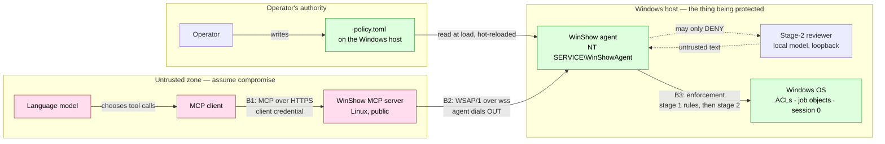

# Security

**Status:** Draft · **Revision:** 2026-07-26

This document states what WinShow is defending, who it is defending it against, and where
the defence actually lives. It is a threat model rather than a hardening checklist: it names
the assets, draws the trust boundaries, enumerates the threats with their mitigations and
their residual risk, and — just as importantly — says plainly what WinShow does not protect
against. The operational instructions that follow from it are in
[`07-operations.md`](07-operations.md); the rules that enforce it are in
[`04-agent-policy.md`](04-agent-policy.md).

RFC 2119 keywords are used as described in [`03-agent-protocol.md`](03-agent-protocol.md),
in capitals and only where the statement is genuinely normative.

---

## Table of contents

1. [Assets](#1-assets)
2. [Principals and trust boundaries](#2-principals-and-trust-boundaries)
3. [Threats, mitigations, and residual risk](#3-threats-mitigations-and-residual-risk)
4. [Why the model must never be the thing that grants access](#4-why-the-model-must-never-be-the-thing-that-grants-access)
5. [What WinShow does not protect against](#5-what-winshow-does-not-protect-against)
6. [MCP-side security requirements](#6-mcp-side-security-requirements)
7. [Secrets handling](#7-secrets-handling)
8. [The audit trail as a security control](#8-the-audit-trail-as-a-security-control)

---

## 1. Assets

WinShow exists to give a language model a controlled window onto one Windows host. Every
security property in this project is ultimately about keeping that window the shape the
operator drew, so it is worth being precise about what is behind the glass.

**The Windows host's filesystem.** Not merely the files inside the configured read roots,
but the whole volume, because the interesting attack is the one that reaches content the
operator never meant to expose. The realistic prizes are private keys, `web.config` and
`appsettings.json` connection strings, `.git` history, browser profiles, and the user
directories that the example policies deny explicitly even though they are not roots. A
successful read of any of those is a full compromise of whatever those credentials protect,
and it is silent — nothing on the Windows host looks broken afterwards.

**The Windows host's ability to execute code.** This is the more valuable of the two assets
by a wide margin. A read gives an attacker data that exists today; an execution gives them
the machine, a foothold inside the network perimeter, and the ability to create data that
did not exist before. Everything in the execution path — the argument-vector model, the
allowlist-only policy mode, the ban on ambient `PATH` resolution, the `cmd.exe`
metacharacter restriction — exists because this asset is worth more than the convenience
that protecting it costs.

**The agent token.** The shared secret in the `Authorization` header of the agent's WebSocket
handshake. Its value is bounded by design: holding it lets the bearer connect as the agent
and receive requests, and — critically — it does **not** confer the ability to run anything,
because it is presented *to* the server, not *by* the server. Its real worth to an attacker
is impersonation and eviction, discussed in §3.

**The audit trail.** The record of what was asked, what was allowed, what was denied, and
what ran. It is an asset in its own right because it is the only thing that answers "what
happened" after an incident, and because an attacker who can edit or flood it converts a
detectable intrusion into an undetectable one. The agent's copy specifically — see §8.

**Not an asset: the policy file's contents.** The policy is a control, not a secret, but it
is treated as sensitive anyway. The agent reports only a *summary* at handshake
([`04-agent-policy.md` §7](04-agent-policy.md#7-the-policy-summary-reported-at-handshake))
because the exact rule set tells an attacker where the gaps are, and knowing that
`argvPrefix = ["build"]` is the rule saves them the trouble of discovering it.

---

## 2. Principals and trust boundaries

### 2.1 The principals

| Principal | What it is | Trusted by the agent? |
|---|---|---|
| Operator | The human who writes `policy.toml`, installs the agent, and holds the tokens | Yes — they are the source of authority |
| Language model | The model driving the MCP client; chooses which tools to call and with what arguments | No |
| MCP client | Claude, or any other MCP client; holds a client credential and speaks to `/mcp` | No |
| MCP server | The Python/Starlette process brokering between `/mcp` and `/agent` | **No** |
| Agent process | The Python service on the Windows host; sole enforcement point | Self |
| Windows OS | ACLs, job objects, the service account's token, session 0 isolation | Yes — it is the layer beneath, and the last one |

The entry that matters is the fourth. **The agent treats the server as untrusted.** This is
not defensive politeness; it is the central design decision of the whole system, recorded in
[ADR 0003](adr/0003-authorization-on-agent-only.md) and made normative in
[`04-agent-policy.md` §1.1](04-agent-policy.md#11-the-agent-is-the-sole-enforcement-point).
The server is a message relay with no authorization role whatsoever. It does not filter
paths, does not inspect argument vectors, and cannot relax a rule. There is deliberately no
protocol field, header, capability, or flag by which it could — an implementer who finds
themselves adding a "the server says this one is fine" path has built a different, weaker
system.

The reasoning is a matter of exposure. The server sits on the public internet, terminates
connections from a client that is itself steered by a language model consuming untrusted
text, and is the component most likely to be reached by an attacker. The Windows host sits
behind NAT with no inbound rule at all. Putting enforcement on the exposed component would
mean that compromising it yields the host. Putting enforcement on the host means that
compromising the server yields the ability to *ask* for anything, and to receive exactly what
the operator wrote down in a file the server has never seen.

### 2.2 The boundaries

Three boundaries carry the weight.

**B1, between the MCP client and the server**, is an ordinary network authentication problem:
the server must know that the caller is entitled to use it at all. It is a coarse boundary —
crossing it grants access to the whole tool surface, not to a subset — which is why it is not
where authorization lives.

**B2, between the server and the agent**, is authenticated with a pre-shared bearer token
over validated TLS ([`03-agent-protocol.md` §1.4](03-agent-protocol.md#14-authentication)).
Note the direction: the agent authenticates *to* the server, and the server authenticates to
the agent only by presenting a TLS certificate the agent's trust configuration accepts. There
is no sense in which the server proves it is entitled to issue a particular request, because
under this design it is never entitled to anything in particular. It asks, and the agent
decides.

**B3, inside the agent**, is the real security boundary and the only one whose failure is
unrecoverable. Everything on the far side of B3 — path canonicalisation against the OS-final
path, component-wise root containment, the exec allowlist, the job object, the service
account's ACLs — is what actually stands between a request and the machine.

---

## 3. Threats, mitigations, and residual risk

The tables below are grouped by boundary. Residual risk is stated honestly: a mitigation that
reduces a threat to something else, rather than to nothing, is described as reducing it to
that something else.

### 3.1 Credentials and transport

| Threat | Mitigation | Residual risk |
|---|---|---|
| **Stolen agent token.** An attacker obtains the contents of `agent.token` and connects to `/agent` as the agent. | The token is stored in a file readable only by the service account and administrators, is never logged at any level, and is excluded from every child process environment by the default `envRedact` patterns. Two tokens are valid simultaneously so rotation is immediate and non-disruptive (§7). Token theft is detectable: the impostor's connection evicts the real agent, and `winshow_agent_reconnects_total` climbs. | The attacker can impersonate the agent and thereby *serve* requests — returning fabricated file contents and fake command output to the model. They cannot run anything on the real Windows host. The genuine agent will reconnect and evict them in turn, producing a visible flap. Treat a sustained reconnect storm as a credential incident, not a network one. |
| **Stolen MCP client credential.** An attacker obtains whatever bearer token or proxy credential authenticates a client at `/mcp`. | The credential is scoped to one server, which brokers one host, whose capabilities are bounded by `policy.toml`. Authentication is enforced at an authenticating reverse proxy in Phase 2 (§6), where revocation is a single configuration change. | The attacker gets exactly the tool surface the operator granted: they can read what the read roots expose and run what the allowlist permits. **This is the threat the policy file is sized against.** If losing that credential would be catastrophic, the policy is too wide — see §5. |
| **MITM on the agent link.** An attacker interposes on `wss://` and reads or rewrites WSAP frames, including file contents and command output. | The agent **MUST** verify the full chain to a trusted root and **MUST** verify the hostname against the certificate SANs ([`03-agent-protocol.md` §1.5](03-agent-protocol.md#15-certificate-validation)). TLS 1.2 minimum, 1.3 preferred. Revocation checking **MUST NOT** be silently disabled. SPKI pinning is available, with at least two pins configured so a certificate rotation does not brick the agent. | An attacker holding a certificate the agent's configured trust store accepts still succeeds. Pinning closes this at the cost of an operational obligation; `tlsTrust = "pin"` should be the choice wherever the certificate lifecycle is under the operator's control. |
| **Corporate TLS-intercepting proxy.** The enterprise middlebox terminates TLS and re-signs with a private CA, so every byte of every file read and every command output is visible to it in cleartext. | The agent keeps the TLS session end-to-end by default. An intercepting proxy is accepted **only** when its CA is explicitly present in the configured trust bundle ([`03-agent-protocol.md` §1.6](03-agent-protocol.md#16-proxy-support)) — never through the ambient Windows store by accident. Interception must be a decision somebody made and wrote down. | Where interception is mandatory corporate policy, the proxy operator sees everything WinShow carries. That is a governance question rather than a technical one, and it should be raised before deployment, not after. Pinning is incompatible with interception, which is a feature: the agent will refuse rather than silently downgrade. |
| **Token in a query string or a log.** The token leaks into proxy access logs, server access logs, browser history, or a bug report. | Normative: the token **MUST** be transported only in the `Authorization` header and **MUST NOT** appear in a query string ([`03-agent-protocol.md` §1.4](03-agent-protocol.md#14-authentication)), and **MUST NOT** appear in any log at any level ([`04-agent-policy.md` §9](04-agent-policy.md#9-audit-obligations)). `logging.redactPatterns` scrubs captured output before it is written. | A crash dump or a debugger on either process still contains the token in memory. Rotation is the answer, and it is cheap by design. |

### 3.2 The server and the client that drives it

| Threat | Mitigation | Residual risk |
|---|---|---|
| **Compromised MCP server.** An attacker owns the Linux process entirely and can issue any WSAP request it likes, in any quantity, with any arguments. | This is the scenario the architecture is built around, and the answer is that it changes nothing about what is permitted. The agent evaluates every request against `policy.toml`, a file the server has never read and cannot influence. There is no trusted-request path. The agent's own audit log — written locally on the Windows host and mirrored into the Windows Event Log — records everything the compromised server asked for, including everything it was refused. | The attacker gets full use of the permitted surface: they can read every file under the read roots and run every allowed command, repeatedly. They can also fabricate what the MCP client sees. The blast radius is precisely the policy, which is why §5 is blunt about a permissive policy being the operator's risk to own. |
| **Malicious or prompt-injected model.** The model driving the MCP client encounters attacker-controlled text — in a file it was asked to read, in a build log, in a web page from another tool — that instructs it to exfiltrate credentials or run something destructive. | The model has no privileged path. Its tool calls arrive at the agent as ordinary requests and are evaluated identically to any other. It cannot enumerate outside the read roots, cannot read a denied glob, and cannot invent an allowed command. Stage 2 adds a second, independent judgement on `exec.start` and can only refuse (§4). Denials are `retryable: false` specifically so a model does not churn through variants hunting for one that lands. | Within the permitted surface the model will do what it was manipulated into doing, and it will do it convincingly. If `dotnet build` is allowed, an injected model can trigger builds; if a read root contains something sensitive that no deny glob covers, it can read it. Narrow roots and pinned argument vectors are the only real defence, and stage 2 is a useful but fallible second opinion. |
| **Prompt injection reaching the model through WinShow's own output.** File contents returned by `fs.read`, or command output relayed by `exec.output`, contain instructions aimed at the model. | The server **MUST** relay tool results as data and never as instructions, and the MCP client is responsible for the same. WinShow does not interpret content it moves. | Unavoidable in the general case: reading untrusted text to a model is the entire point of the tool. The mitigation is architectural rather than syntactic — the model cannot escalate on the basis of what it read, because the policy does not consult the model. |
| **Prompt injection through a stage-2 reason string.** A local reviewer that has itself been injected by the content it was reviewing emits a `details.reason` crafted to influence the server, the client, or the model reading the error. | The agent **MUST** parse the reviewer's output into a strict verdict shape — an allow/deny boolean and a bounded reason string — cap its length, strip control characters, and discard everything else. The reviewer fills exactly one slot, `details.reason`, and **MUST NOT** be allowed to select the rule id, the error code, or any other structured field. The reason is tagged `reasonSource: "model"`, the server **MUST** relay it labelled as untrusted generated content, and no component may act on it as instructions ([`03-agent-protocol.md` §7.3](03-agent-protocol.md#73-details-for-policy_denied), [`04-agent-policy.md` §6.6](04-agent-policy.md#66-the-verdict-is-untrusted-text)). | A denial message shown to a user may contain adversarial prose. It is displayed text and nothing more; the worst outcome is a confusing or misleading explanation attached to a refusal that already happened. |

### 3.3 The agent's enforcement surface

These are the threats whose success would be an outright authorization failure, and they are
where an implementation is most likely to be quietly wrong.

| Threat | Mitigation | Residual risk |
|---|---|---|
| **Path traversal via `..`, junctions, symlinks, or 8.3 short names.** A request for `C:\src\link\...` where `link` is a junction to `C:\Users`, or for `C:\PROGRA~1\...`, escapes the read roots without ever containing a suspicious string. | Canonicalisation is normative and ordered, and it is followed by the escape check: the agent **MUST** obtain the **OS-final path** via `GetFinalPathNameByHandle` or equivalent and **MUST** evaluate policy against that, never against the lexical path ([`03-agent-protocol.md` §10.1](03-agent-protocol.md#101-path-handling), [`04-agent-policy.md` §1.4](04-agent-policy.md#14-evaluate-resolved-values-never-raw-input)). Containment compares whole path components with ordinal case-insensitive comparison, so `C:\src2` does not match root `C:\src`. `followLinks` defaults to `false`. Reserved device names, trailing dots and spaces, and alternate data streams are rejected. A worked escape attempt is in [`examples/transcript-policy-denial.jsonl`](examples/transcript-policy-denial.jsonl). | Time-of-check-to-time-of-use: an administrator on the host can replace a directory with a junction between the check and the open. That attacker already has the machine (§5). The residual risk for everyone else is implementation error, which is why this rule is called the single most important one in the protocol document and why [`08-conformance.md`](08-conformance.md) tests it directly. |
| **Command injection via shell metacharacters.** `; & | \` $()` smuggled through an argument turns one permitted command into two. | The default and required mode is direct process creation with an explicit argument vector — `CreateProcessW`, no shell, no `ShellExecute` ([ADR 0006](adr/0006-createprocess-argv-not-shell.md)). There is nothing to inject into, because there is no parser downstream. Shells are separate, individually permitted modes: `shellsAllowed` gates them, and `shell = "cmd"` **MUST** reject a `commandLine` containing `& \| < > ^ %` or an odd number of `"` unless `allowUnsafeCmdMetacharacters = true`. Shell rules match the **entire** script against anchored patterns, and anchoring is enforced at load — an unanchored allow pattern is a policy validation failure, because `Get-Service` unanchored also matches `Get-Service; Remove-Item -Recurse C:\`. | An operator who enables `cmd` and sets `allowUnsafeCmdMetacharacters = true` has opted out. A shell allow rule with a loose pattern — or an `argvPrefix` that permits arguments with side effects, such as `dotnet build --property:PreBuildEvent=…` — is a policy bug, and [`04-agent-policy.md` §10](04-agent-policy.md#10-writing-a-policy-a-suggested-order) exists to help find those on purpose. |
| **`PATH` substitution.** Anyone who can write the service's environment, or prepend a directory to `PATH`, redirects a bare executable name to a binary of their choosing. | The ambient `PATH` **MUST NOT** be consulted. A bare `argv[0]` resolves only against the policy's `executableSearchPath`, and an ambiguous or failed resolution is `EXEC_NOT_FOUND` ([`04-agent-policy.md` §5.5](04-agent-policy.md#55-executable-resolution)). Requests cannot set `PATH`, `PATHEXT`, `ComSpec`, `SystemRoot`, or `windir` unless the policy sets `envAllowSensitive = true`, which defaults to `false` precisely because overriding `PATH` is executable substitution by another name. `.bat`, `.cmd`, and `.ps1` are refused under `shell = "none"`, since Windows would silently route them through a shell and defeat the argv model. | Someone who can write to a directory listed in `executableSearchPath`, or replace an allowlisted executable in place, wins. Those directories and binaries must be administrator-writable only; the agent's own service account **MUST NOT** be able to write them. |
| **Credential exfiltration by reading configuration files.** The target is not code but `web.config`, `appsettings.Production.json`, `.git/config`, `id_rsa`, or a `.pfx` that happens to live inside a legitimate read root. | Read roots are an allowlist, and `denyGlobs` are applied to the final path *after* the roots have allowed it, with any match denying. Deny globs are not redundant with roots and the example policies carry them even in the minimal configuration: roots express where the operator meant to grant access, deny globs catch the private key that ended up inside one of them anyway. `rootOverrides.allowedExtensions` can narrow a root to a specific file type — the developer example restricts `D:\Logs` to `.log`, `.txt`, `.json`, `.etl`. | Deny globs only catch what the operator thought of. A secret in an unusually named file inside a broad root is readable. The mitigation is narrow roots first and deny globs as the safety net, not the reverse. |
| **A second agent connects — eviction abuse.** An attacker with the token connects repeatedly, evicting the legitimate agent each time and denying service, or racing to serve requests. | Newest-agent-wins is the deliberate rule ([ADR 0007](adr/0007-newest-agent-wins.md)): the superseded connection receives `session.bye` with `reason: "superseded"` and closes with code `4009`, and `bySessionId` names the successor so both sessions can be stitched together in a log. The alternative — oldest wins — makes a half-dead connection permanently unrecoverable, which is the more common real failure. Every eviction is logged on both sides, and no state is ever resumed across connections. | Eviction is a denial-of-service primitive for anyone holding the token, and it is noisy rather than stealthy. Alert on `winshow_agent_reconnects_total`. Mutual TLS ([`03-agent-protocol.md` §1.4](03-agent-protocol.md#14-authentication)) raises the bar by binding the connection to a client certificate whose subject must equal the `agentId`. |

### 3.4 Availability, resource use, and the record

| Threat | Mitigation | Residual risk |
|---|---|---|
| **Resource exhaustion and denial of service.** A caller — or a compromised server — issues thousands of `fs.glob` calls over `C:\`, spawns processes until the host thrashes, or asks for a command that emits gigabytes. | Every limit is advertised at handshake and enforced by the agent, not requested by the server: `maxConcurrentRequests`, `maxConcurrentProcesses`, `maxOutputBytesPerExec`, `maxExecMillis`, `maxReadBytes`, `maxGlobResults`, and time budgets on `fs.glob` and `fs.grep`. Excess requests are refused with `AGENT_BUSY` rather than queued, because unbounded queueing turns a burst into memory exhaustion and hides the misbehaviour ([`03-agent-protocol.md` §8.3](03-agent-protocol.md#83-limits-and-agent_busy)). Output flows under a credit window; when it fills, the agent stops reading the child's pipes and lets ordinary OS backpressure block the child, and after `sendStallTimeoutMs` it kills the tree with `exitReason: "backpressure"`. The regex dialect for `fs.grep` excludes backreferences and lookaround so that catastrophic backtracking is structurally impossible rather than merely unlikely. Job objects carry `JobMemoryLimit` and `ActiveProcessLimit`. The server **SHOULD** rate-limit failed `/agent` authentications: five failures from one source in 60 seconds, then `429` with `Retry-After`. | A permitted command that is expensive is still expensive, and the agent will faithfully run it up to `maxExecMillis`. The agent competes for CPU and disk with whatever else the host is for. Sizing the limits is an operator decision, and `maxConcurrentProcesses = 4` is a default, not a recommendation for every machine. |
| **Log injection.** A file path, a command output line, or a model-generated reason contains newlines, ANSI escapes, or forged JSON objects, and corrupts the audit record or the console of whoever reads it. | Logs and the audit trail are JSON Lines — [`04-agent-policy.md` §9](04-agent-policy.md#9-audit-obligations) names `agent.jsonl` and `audit.jsonl` — so an embedded newline is escaped by the encoder and cannot forge a record boundary. The protocol already requires control characters and lone surrogates to be escaped or replaced so that every frame is valid JSON, and invalid surrogate pairs become U+FFFD ([`03-agent-protocol.md` §10.2](03-agent-protocol.md#102-encoding)). `logging.redactPatterns` is applied to captured output before it is written. | A log *viewer* that renders raw fields can still be attacked by ANSI escapes; that is a property of the viewer. Volume is the other residual concern — a chatty attacker can roll the log files over and push older records out, which is what `maxFileBytes`/`maxFiles` bound and why the Event Log mirror matters. |
| **Audit tampering.** An attacker who reaches the Windows host edits or truncates `audit.jsonl` to remove the record of what they did. | The audit file is append-only and lives under `%ProgramData%\WinShow\logs\`, where the service account has append rights and administrators own the directory. Execution records are mirrored into the Windows Event Log with `eventLog = true`, which lands them in whatever SIEM the organisation already collects Windows events into and therefore off the machine. | An administrator on the host can clear the Event Log and rewrite the file (§5). Shipping records off-box promptly is the only real answer, and it is the reason the Event Log mirror is on by default in the example policies. |

---

## 4. Why the model must never be the thing that grants access

WinShow deliberately contains two models, and neither of them is permitted to widen access.

The first is the model driving the MCP client. It chooses which tool to call and with what
arguments, and every one of those choices is a *request*. The agent evaluates it against
rules a human wrote. The model's confidence, its reasoning, and its stated justification are
all irrelevant to the outcome, and none of them travels anywhere the policy engine reads.

The second is the optional stage-2 reviewer, a small local model on the Windows host. Its
placement is the entire safety property, and
[`04-agent-policy.md` §6](04-agent-policy.md#6-stage-2-model-assisted-review) makes it
normative: **stage 2 runs only on requests stage 1 has already allowed, and it can only ever
deny.** Three consequences follow, and they are worth stating separately because each
forecloses a different bad design.

**A model must never be the thing that grants access.** If stage 2 ran first, or could
overturn a stage-1 denial, the security of the Windows host would rest on a small model's
judgement under adversarial input. Small models are not adversarially robust, and the inputs
here — file paths, command lines, sometimes file contents — are exactly the kind of text an
attacker controls. The host's security rests instead on deterministic rules in a TOML file
that an administrator wrote and can read.

**The worst a compromised, confused, or prompt-injected reviewer can do is refuse work.** A
reviewer that has been talked into approving something still does not approve it, because
approval is not an output stage 2 has. It has one lever and it points one way. Denial is an
availability problem, which is recoverable by an operator with a text editor; authorization
failure is not.

**Removing stage 2 entirely never grants access.** An agent with `enabled = false` behaves
exactly like one whose reviewer approves everything. Stage 1 is the floor, and no
configuration lowers it. This is why `failMode` is a genuine choice rather than a trap:
`"closed"` denies when the reviewer errors, `"open"` allows, and both are safe with respect to
authorization because both are bounded above by stage 1.

The reviewer's *output* is a separate matter and is treated as hostile input, per §3.2:
strict verdict parsing, a bounded reason string, control characters stripped, no ability to
populate any structured field other than `details.reason`, and a `reasonSource: "model"` tag
that obliges the server to relay it labelled as untrusted generated content. A verdict is a
boolean; an explanation is a string to display. Neither is an instruction to anybody.

---

## 5. What WinShow does not protect against

A threat model that only lists wins is marketing. These are the cases where WinShow offers
little or nothing, stated so that nobody discovers them at the wrong moment.

**An operator who writes a permissive policy.** WinShow enforces the policy; it does not
judge it. A read root of `C:\` with no deny globs exposes the machine. An allow rule with
`argvPrefix = []` on `powershell.exe` is a remote shell with extra steps. The tool makes the
narrow configuration expressible and the broad one obvious, and it removes the worst option
entirely — there is no `mode = "any"` for execution, on purpose — but the operator owns the
outcome. [`04-agent-policy.md` §10](04-agent-policy.md#10-writing-a-policy-a-suggested-order)
gives an incremental order for building a policy, and the question to ask at every step is
not "does this let me do what I want" but "what else does this let me do".

**An administrator on the Windows host.** Anyone in the local Administrators group can rewrite
`policy.toml`, replace the agent binary, read the token, clear the Event Log, and attach a
debugger to the agent process. WinShow's controls sit *below* that principal and cannot bind
it. This is a plain consequence of the Windows security model, not a gap to be fixed.

**Anyone holding the agent token already has whatever the policy permits — indirectly.** More
precisely: the token lets its holder be the agent, not command it, so possession does not by
itself yield execution on the real host. But token theft usually implies file-read access on
the Windows host or on the operator's workstation, and an attacker with either is already
somewhere they should not be. Treat token exposure as an incident that warrants rotation and
an inventory of what else was in reach, not as a contained event.

**The MCP client's own security.** WinShow has no visibility into how the client stores its
credential, which model it runs, what other tools that model can reach, or whether the human
in front of it is who they claim. A client that leaks its credential or is driven by a
compromised model is outside the boundary. The counterweight is that the client's authority
is bounded by the policy — which is the argument for keeping the policy tight even when the
client is trusted.

**Supply chain.** The agent is Python and depends on a package ecosystem; the server depends
on `mcp`, Starlette, and uvicorn; the stage-2 reviewer depends on a local inference runtime
and a model file. A malicious dependency on the Windows side runs with the agent's
privileges, and a malicious dependency on the server side is the compromised-server case from
§3.2. Pin versions, verify hashes, and build the agent's distributable on a machine you
control.

**A Windows privilege-escalation bug.** The agent runs as a low-privilege virtual service
account specifically so that a defect in it does not own the machine, and it runs with
`RequiredPrivileges` reduced to `SeChangeNotifyPrivilege`. That containment holds only as far
as the operating system's own boundaries hold. A kernel or service-isolation vulnerability
underneath WinShow is not something WinShow can compensate for; keep the host patched.

**Data at rest and in the model's context.** File contents that cross the boundary end up in
the MCP client's context and in whatever that client retains. WinShow controls what leaves
the host, not what happens to it afterwards.

---

## 6. MCP-side security requirements

The `/mcp` endpoint is a Streamable HTTP MCP transport, and the MCP specification imposes
requirements on it that are easy to miss because they concern the browser threat model rather
than the API one.

**Origin validation is mandatory.** Servers **MUST** validate the `Origin` header on every
incoming connection and reject anything unexpected. The concrete failure this prevents is DNS
rebinding: a page in the user's browser resolves a name it controls to the server's address
and then issues requests that carry the user's ambient credentials. WinShow returns **403
Forbidden** for an invalid or absent-where-required `Origin`, before any MCP processing. The
allowed origins are configuration, not a wildcard.

**Bind loopback when running locally.** A server **SHOULD** bind `127.0.0.1` rather than
`0.0.0.0` when it is intended for local use, so that "localhost only" is enforced by the
socket rather than by a policy nobody re-checks after the next network change. WinShow's
production topology is a public server rather than a local one, so this applies chiefly to
development runs — and to the `/metrics` endpoint, which binds a separate admin address in
every topology (see [`07-operations.md`](07-operations.md)).

**Authenticate.** The specification says servers **SHOULD** authenticate all connections, and
it is worth being precise about the status of MCP authorization: it is **OPTIONAL** in the
specification. A server may implement it, and a client must handle a server that does not.

The full form the specification describes is an OAuth 2.1 flow in which the MCP server is a
**resource server**: it publishes protected resource metadata per **RFC 9728**, pointing
clients at the authorization server; clients discover that metadata from the `WWW-Authenticate`
header of a `401`; tokens are **audience-bound** to the specific MCP server, and the server
**MUST** reject a token that was not issued for it. That last requirement is the one that
matters, and it exists to forbid token passthrough — a server that accepts a token minted for
somewhere else becomes a confused deputy, and the audience check is what makes that
structurally impossible rather than merely discouraged.

**Phase 2 does not implement that.** WinShow Phase 2 authenticates `/mcp` with a **static
bearer token verified by an authenticating reverse proxy in front of the server**, with the
proxy also terminating TLS and enforcing rate limits. The tradeoff, in one line: a static
token buys a deployment that works today with any MCP client and one place to revoke, and
costs per-user identity, expiry, scoping, and audience binding — so the token is a single
coarse credential whose loss is equivalent to loss of the whole tool surface, and it must be
rotated on a schedule rather than relied on to expire. Full OAuth 2.1 resource-server support
is tracked in [`09-roadmap.md`](09-roadmap.md).

**Sessions.** The Streamable HTTP transport's `Mcp-Session-Id`, when issued, **MUST** be
cryptographically secure and **MUST NOT** be treated as an authentication credential —
authorization is checked on every request regardless of session state. A session identifier
says which conversation this is, never who is allowed to have it.

---

## 7. Secrets handling

There are two secrets in a WinShow deployment: the agent token, and whatever credential
authenticates the MCP client. The rules below are written for the agent token and apply to
both.

**Generation.** At least **32 bytes of CSPRNG output**, presented as a printable ASCII
string; Base64url of 32 random bytes is RECOMMENDED. On Linux, `python3 -c "import secrets;
print(secrets.token_urlsafe(32))"` is sufficient and is what
[`07-operations.md`](07-operations.md) uses. Do not derive a token from a hostname, a
timestamp, a UUID, or anything else an attacker can enumerate.

**Storage on the Windows host.** The token lives in a file — `agent.token` under
`%ProgramData%\WinShow\` — referenced by `connection.tokenFile`, never inline in
`policy.toml` and never in the agent's source. The file's ACL grants Read to the service
account and Full Control to Administrators and SYSTEM, and nothing else. The agent **MUST**
load it from that file or from an OS secret store, and **MUST NOT** load it from a
world-readable location.

**Storage on the server.** The server holds the set of currently valid tokens, and **MUST**
compare a presented token in **constant time**. A naive comparison leaks the token one byte
at a time to a patient attacker, and the fix costs one function call.

**Two-token rotation.** The server **MUST** support two simultaneously valid tokens. This is
what makes rotation a non-event: add the new token to the server's set, restart the agent with
the new value, confirm the connection, then remove the old token. There is no window in which
neither works, and no coordinated restart. The procedure is in
[`07-operations.md`](07-operations.md); rotate on a schedule and immediately on any suspicion
of exposure.

**Never in a query string, never in a log.** Both are normative
([`03-agent-protocol.md` §1.4](03-agent-protocol.md#14-authentication)). Query strings land in
proxy access logs, server access logs, and referrer headers, all of which are retained
somewhere nobody thinks of as sensitive. The agent's token **MUST NOT** appear in any log at
any level, and the default `envRedact` patterns — `WINSHOW_*`, `*TOKEN*`, `*SECRET*`,
`*PASSWORD*`, `*_KEY` — keep it out of every child process's environment, because a permitted
command that dumps its environment must not become a token disclosure.

**Rotate the TLS material too.** Where `tlsTrust = "pin"` is in use, configure at least two
SPKI pins so that a certificate rotation does not brick the agent, and add the incoming pin
before the old certificate is retired.

---

## 8. The audit trail as a security control

The audit trail is treated as a control rather than as diagnostics, which is why its contents
are specified normatively in
[`04-agent-policy.md` §9](04-agent-policy.md#9-audit-obligations) rather than left to the
implementation.

**It is written on both sides.** The server records what each MCP client asked for and what it
returned. The agent records, before dispatch, the resolved argv, the resolved executable, the
working directory, the *names* of overlaid environment variables — never their values — the
stage-1 decision with its rule id, the stage-2 verdict when stage 2 ran, and the correlation
id; and after completion, the pid, exit code, exit reason, duration, and byte counts. Every
denial is recorded with its true reason, **including** denials that were disclosed to the
caller as `NOT_FOUND` under `denialDisclosure = "notfound"` — the caller is told less, the log
is told everything.

**The agent's copy is the one that matters.** This is not redundancy for its own sake. The
server is the component most exposed to attack, and an attacker who owns it also owns its
logs; a record that only exists there is a record an attacker can edit to describe a different
incident. The agent's copy is written on the machine the requests were executed against, by
the process that made the decisions, and it survives a compromised server intact. It is also
the copy that answers the question a compromised server makes urgent — *what did it ask for
while it was compromised* — because it contains the requests the server issued, including
every one that was refused.

**It leaves the machine.** With `eventLog = true`, execution records are mirrored into the
Windows Event Log, which is already collected by whatever SIEM the organisation runs. That
gets the record off the host promptly, which is the only defence against an administrator-level
attacker clearing it later.

**Correlation is deliberate.** Every record carries the WSAP correlation id, and the envelope
carries an optional W3C `traceparent`, so a single tool call can be followed from the MCP
client through the server to the agent's decision and the process it started. An audit trail
that cannot be joined across the boundary answers "something was denied" but not "which
request, from whom, and what did they try next".

**What to watch is `winshow_policy_denials_total`.** A denial is normal in ones and twos — it
is a model discovering the shape of the policy. A sustained rise is either a misconfigured
policy or something probing for a gap, and the two are distinguishable only by reading the
audit records behind the counter. The alerting guidance and the rest of the metric set are in
[`07-operations.md`](07-operations.md).
